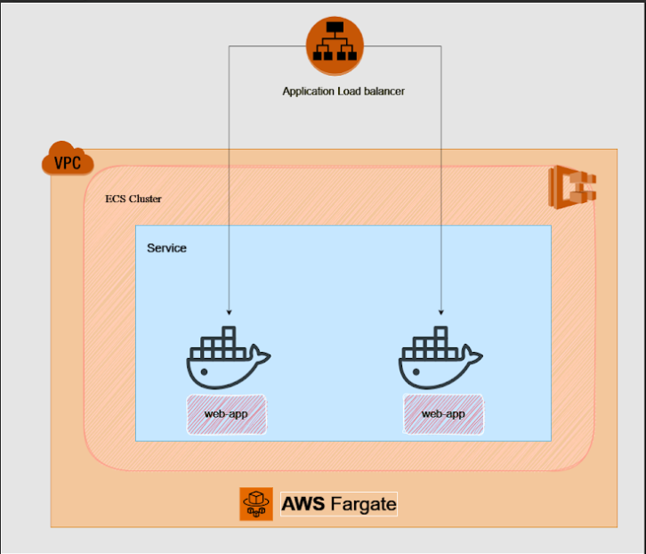

# Flask Web App Deployment with AWS ECS Fargate using CI/CD

This project aims to deploy a simple Flask web app to AWS ECS Fargate using a CI/CD pipeline orchestrated with GitHub Actions. The project adheres to the following evaluation criteria:

## Architecture



## Deploy Pipeline


##  Outline

- **Flask Application**:
  - The Flask application is structured following best practices.
  - Code readability and organization are emphasized.
  - Usage of appropriate Flask conventions and patterns is demonstrated.
- **Dockerfile**:
  - The Dockerfile efficiently sets up the environment for the Flask app.
  - Docker best practices such as layer caching and container optimization are observed.
- **CI/CD Configuration**:
  - GitHub Actions workflow is logically organized and well-documented.
  - Proper error handling and validation are implemented in the CI/CD pipeline.

### 2. Successful Implementation of a CI/CD Pipeline

- **Testing**:
  - The CI/CD pipeline executes tests for the Dockerfile, ensuring reliability.
  - Testing procedures are clearly outlined in the workflow.
- **Building and Deployment**:
  - The pipeline successfully builds the Docker image upon code changes.
  - Docker image pushing to AWS ECR and ECS deployment are automated.
  - Proper versioning or tagging strategies are employed for images and ECS tasks.
- **Integration with AWS Services**:
  - Effective integration with AWS services (ECR, ECS) is demonstrated.
  - ECS Fargate setup and deployment align with AWS best practices.


---

## Project Structure

- `app.py`: Contains the Flask web application code.
- `Dockerfile`: Defines the Docker image configuration.
- `task-definition.json`: ECS task definition file.
- `.github/workflows/main.yml`: GitHub Actions workflow for CI/CD.

## Setup Process

### Local Deployment

To run the Flask web app locally:

1. Ensure you have Docker installed.
2. Clone this repository.
3. Navigate to the project directory.
4. Build the Docker image:

   ```bash
   docker build -t flask-app .
## Running the Docker Container

To run the Docker container:

```bash
docker run -p 80:80 flask-app
```
check the deployed version at  [http://flaskapp-lb-235057338.ap-south-1.elb.amazonaws.com/](http://flaskapp-lb-235057338.ap-south-1.elb.amazonaws.com/)

## CI/CD Pipeline

The CI/CD pipeline is configured with GitHub Actions. Upon pushing changes to the main branch, the pipeline performs the following steps:

- Tests the Dockerfile.
- Builds the Docker image.
- Logs in to AWS ECR and pushes the image.
- Updates the ECS Fargate task definition.
- Deploys the updated task definition to ECS Fargate.

## CI/CD Execution

### Prerequisites

Ensure you have set up the following secrets in your GitHub repository:

- `AWS_ACCESS_KEY_ID`
- `AWS_SECRET_ACCESS_KEY`

### Workflow Execution

1. Make changes to your code locally.
2. Push changes to the main branch:
   ```bash
   git push origin main
   ```
   GitHub Actions will automatically trigger the CI/CD pipeline.

## Why Fargate for this Use Case

AWS Fargate is suitable for this deployment because:

- **Serverless:** Fargate abstracts infrastructure management, allowing focus on application development.
- **Scalability:** Automatically scales resources based on demand.
- **Cost-Efficient:** Pay only for the resources consumed by the containers.

